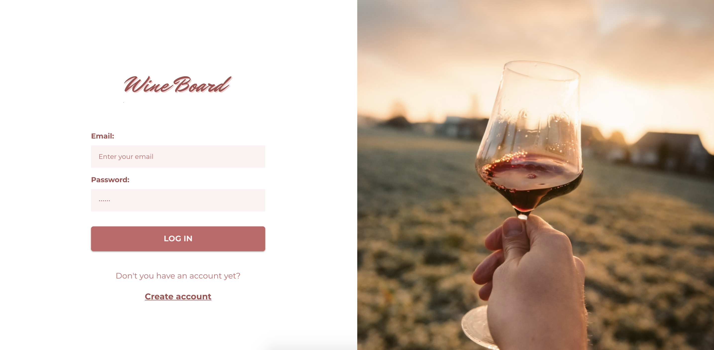

# WineBoard

WineBoard is an app that I built based on the [MERN Bootcamp by Jean Rawers](https://github.com/jeanrauwers/mern-course-bootcamp). 

## Tools:
- [x] React Hooks;
- [x] Styled Components;
- [x] Styled Components;
- [x] MongoDB;
- [x] ExpressJS;
- [x] Mongoose;

**You can see the live demo of [WineBoard](https://wineboard-frontend.herokuapp.com/).**